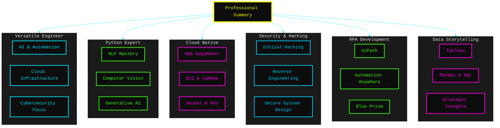
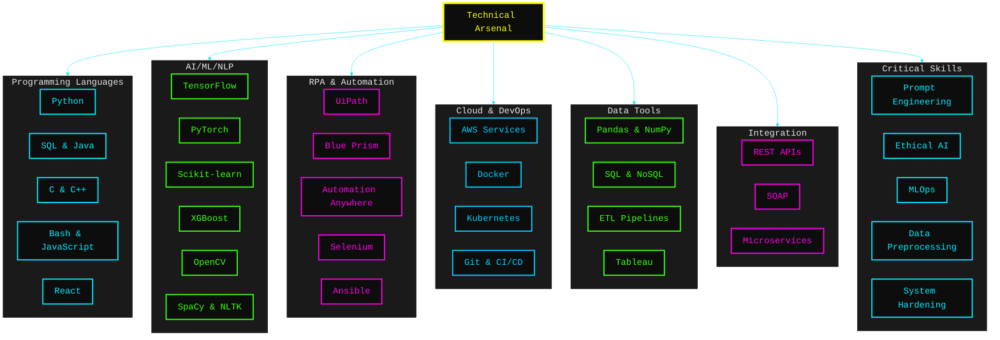
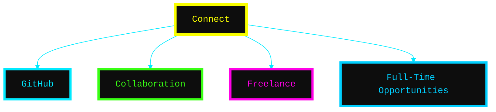

```mermaid
%%{init: {'theme':'base', 'themeVariables': {
  'primaryColor':'#0d0d0d',
  'primaryTextColor':'#39ff14',
  'primaryBorderColor':'#39ff14',
  'lineColor':'#00eaff',
  'fontFamily':'monospace',
  'fontSize':'18px'
}}}%%

graph TB
    A[About Me]
    B[AI-Driven Development]
    C[Generative AI Expert]
    D[Cybersecurity Specialist]
    E[Data Analytics Pro]
    F[Full-Stack AI Engineer]
    G[Production-Grade Systems]
    
    A --> B
    A --> C
    A --> D
    A --> E
    A --> F
    A --> G

    classDef header fill:#0d0d0d,stroke:#f9ff00,stroke-width:5px,color:#f9ff00
    classDef ai fill:#0d0d0d,stroke:#00eaff,stroke-width:4px,color:#00eaff
    classDef gen fill:#0d0d0d,stroke:#39ff14,stroke-width:4px,color:#39ff14
    classDef security fill:#0d0d0d,stroke:#ff00e6,stroke-width:4px,color:#ff00e6
    classDef data fill:#0d0d0d,stroke:#00cfff,stroke-width:4px,color:#00cfff
    classDef fullstack fill:#0d0d0d,stroke:#39ff14,stroke-width:4px,color:#39ff14
    classDef production fill:#0d0d0d,stroke:#ff00e6,stroke-width:4px,color:#ff00e6

    class A header
    class B ai
    class C gen
    class D security
    class E data
    class F fullstack
    class G production

```

```mermaid
%%{init: {'theme':'base', 'themeVariables': {
  'primaryColor':'#0d0d0d',
  'primaryTextColor':'#39ff14',
  'primaryBorderColor':'#39ff14',
  'lineColor':'#00eaff',
  'fontFamily':'monospace',
  'fontSize':'16px'
}}}%%

graph TB
    A[Why Me]
    
    B[Engineers Solutions]
    C[Technical Depth]
    D[Business Impact]
    E[Clear Communication]
    F[Ownership Mindset]
    G[Stays Ahead]
    H[Ethics & Innovation]
    
    A --> B
    A --> C
    A --> D
    A --> E
    A --> F
    A --> G
    A --> H

    classDef header fill:#0d0d0d,stroke:#f9ff00,stroke-width:5px,color:#f9ff00
    classDef value1 fill:#0d0d0d,stroke:#00eaff,stroke-width:4px,color:#00eaff
    classDef value2 fill:#0d0d0d,stroke:#39ff14,stroke-width:4px,color:#39ff14
    classDef value3 fill:#0d0d0d,stroke:#ff00e6,stroke-width:4px,color:#ff00e6
    classDef value4 fill:#0d0d0d,stroke:#00cfff,stroke-width:4px,color:#00cfff
    classDef value5 fill:#0d0d0d,stroke:#39ff14,stroke-width:4px,color:#39ff14
    classDef value6 fill:#0d0d0d,stroke:#ff00e6,stroke-width:4px,color:#ff00e6
    classDef value7 fill:#0d0d0d,stroke:#00eaff,stroke-width:4px,color:#00eaff

    class A header
    class B value1
    class C value2
    class D value3
    class E value4
    class F value5
    class G value6
    class H value7

```

# 👨🏻‍🚀 *Generative AI Engineer*

#

#

#

#

#

<h1 align="left">
   Tech Stack
</h1>

<table style="border-collapse: collapse; width: 100%; max-width: 900px; margin: 20px auto; font-family: Arial, sans-serif;">
  <tr>
    <!-- JavaScript, CSS, HTML -->
    <!-- Python and Python tools -->
    <td align="center" style="padding: 12px;">
       Python
    </td>
    <td align="center" style="padding: 12px;">
       Pandas
    </td>
    <td align="center" width="96">
  
   Generative AI
</td>
    <td align="center" style="padding: 12px;">
       Matplotlib
    </td>
    <td align="center" style="padding: 12px;">
       Scikit-learn
    </td>
    <td align="center" style="padding: 12px;">
       TensorFlow
    </td>
    <td align="center" style="padding: 12px;">
       GitHub
    </td>
    <td align="center" style="padding: 12px;">
       Git
    </td>
    <td align="center" style="padding: 12px;">
       MySQL
    </td>
  </tr>

  <tr>
    <td align="center" style="padding: 12px;">
       JavaScript
    </td>
    <td align="center" style="padding: 12px;">
       CSS3
    </td>
    <td align="center" style="padding: 12px;">
       HTML5
    </td>
    <td align="center" style="padding: 12px;">
       TailwindCSS
    </td>
    <td align="center" style="padding: 12px;">
       Vite
    </td>
    <td align="center" style="padding: 12px;">
       React
    </td>
    <td align="center" style="padding: 12px;">
       MongoDB
    </td>
    <td align="center" style="padding: 12px;">
       Figma
    </td>
    <td align="center" style="padding: 12px;">
       Streamlit
    </td>
  </tr>

  
    
  

  <tr>
    <td align="center" style="padding: 12px;">
       NumPy
    </td>
    <td align="center" style="padding: 12px;">
       Slack
    </td>
    <td align="center" style="padding: 12px;">
       Seaborn
    </td>
    <td align="center" style="padding: 12px;">
       Keras
    </td>
    <td align="center" style="padding: 12px;">
       FastAPI
    </td>
    <td align="center" style="padding: 12px;">
       BeautifulSoup
    </td>
    <td align="center" style="padding: 12px;">
       Scrapy
    </td>
    <td align="center" style="padding: 12px;">
       Postman
    </td>
    <td align="center" style="padding: 12px;">
        Bash
    </td>
  </tr>
 
</table>
